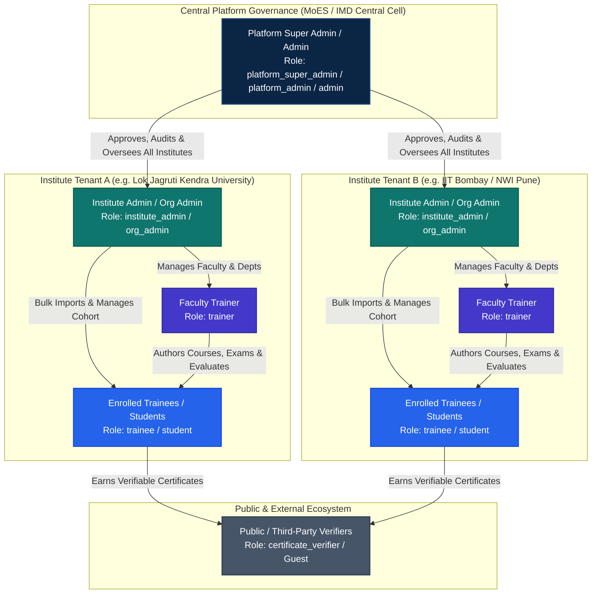
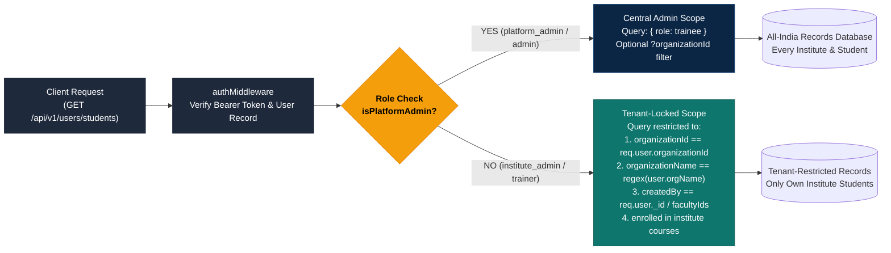
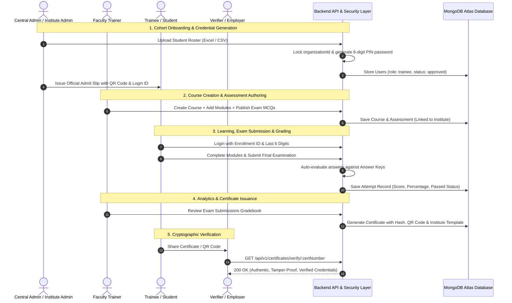
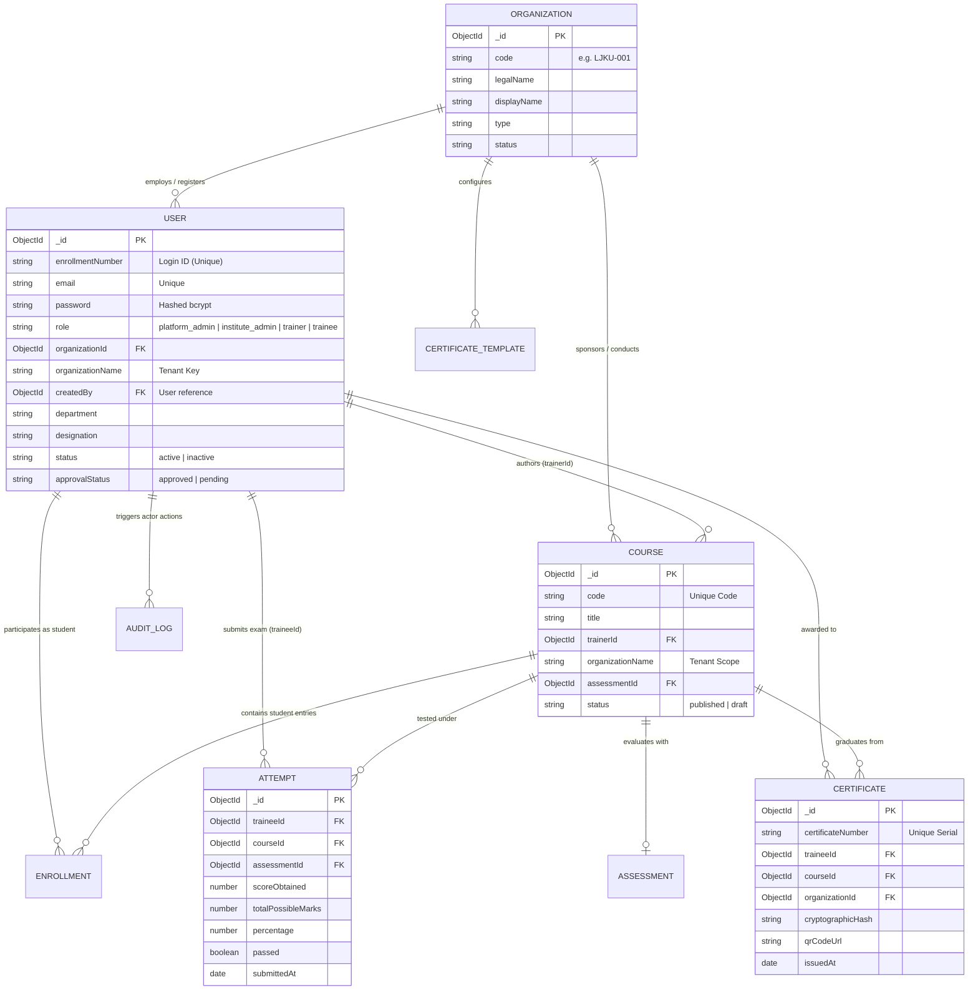

# Role-Based Access Control (RBAC) & Multi-Tenant Architecture

> **CapacityConnect (MoES / IMD Capacity Building Platform)**  
> Comprehensive Technical Architecture, Tenant Isolation Protocols, and Security Governance

  

---

## 1. High-Level Role Hierarchy & Architecture

The platform enforces a **Hybrid Multi-Tenant & Hierarchical RBAC System**. The Central Government platform admins govern the nationwide taxonomy and policies, while affiliated Universities and Autonomous Institutes enjoy isolated workspaces for their faculty and student cohorts.

---

## 2. Multi-Tenant Data Isolation Protocol

The platform implements strict tenant isolation:
- **Institute Admins & Trainers** can **NEVER** view, modify, or leak records from other institutions.
- **Central Platform Admins** possess comprehensive oversight across all institutes with dynamic filtering.

---

## 3. Role Responsibilities & Capabilities Matrix

| Feature / Module | Platform Super Admin | Institute Admin | Faculty Trainer | Trainee / Student | Certificate Verifier |
| :--- | :---: | :---: | :---: | :---: | :---: |
| **System Roles** | `platform_super_admin`, `platform_admin`, `admin` | `institute_admin`, `org_admin` | `trainer` | `trainee`, `student` | `certificate_verifier`, `guest` |
| **Institutional Scope** | **All Institutes (National)** | **Own Institute Only** | **Own Institute / Assigned Courses** | **Own Student Profile** | **Public Verification Only** |
| **Executive Dashboard** |  Full Nationwide KPIs |  Institute Specific |  Trainer Studio |  Personal Learner Hub | ❌ |
| **Excel Student Onboarding** |  Any / All Institutes |  Locked to Own Institute |  Locked to Own Institute | ❌ | ❌ |
| **Generate 6-Digit Password ID Cards** |  All Institutions |  Own Students |  Own Students | ❌ (View Own ID) | ❌ |
| **Print Admit / Credential Slips** |  Multi-Institute Select |  Own Institute Only |  Own Institute Only | ❌ | ❌ |
| **Course Authoring Wizard** |  Govt Course Builder |  Curriculum & Allocations |  Course Studio & Modules | ❌ | ❌ |
| **Question Bank & MCQ Studio** |  National Bank |  Dept Banks |  Personal & Course MCQs | ❌ | ❌ |
| **Attempt Exams & Quizzes** | ❌ (Review Only) | ❌ (Review Only) | ❌ (Review Only) |  Real-Time Exams | ❌ |
| **Attendance Tracking** |  Global Log |  Institute Sessions |  Classroom Attendance |  View Own Attendance | ❌ |
| **Competency Framework** |  Full Taxonomy Control |  Mapping & Alignment |  Rubric Mapping |  View Passport | ❌ |
| **Certificate Designer** |  National Seal & Master |  Institute Seal / Signature | ❌ | ❌ | ❌ |
| **QR Code Certificate Verification** |  Verify & Audit |  Verify Own Graduates |  Verify Own Graduates |  Share Verification Link |  Public QR Scan & Verify |
| **User Approvals / Verification** |  Full Authority |  Approve Dept Faculty | ❌ | ❌ | ❌ |
| **Security Audit Logs** |  System-Wide Trail |  Institute-Wide Trail | ❌ | ❌ | ❌ |

---

## 4. End-to-End Operational Lifecycle

The lifecycle demonstrates how roles interact across student onboarding, exam attempts, grading, and instant credential verification.

---

## 5. Database Schema & Relational Integrity

---

## 6. Security Enforcement & Defense-in-Depth

1. **Authentication Token Inspection**:
   - Every request is validated by `authMiddleware` via JWT signed by cryptographic server secrets.
   - User identity, role, and organization association are injected into `req.user`.

2. **Query Scoping (Row-Level Security)**:
   - In `studentOnboardingController.js` and `courseController.js`, queries automatically append isolation clauses whenever `req.user.role !== 'platform_admin'`.
   - Trainee queries are scoped to:
     - `organizationId == req.user.organizationId`
     - `organizationName == regex(req.user.organizationName)`
     - `createdBy == req.user._id` or created by faculty trainers in that institute.

3. **Creator Protection**:
   - When bulk importing or creating single students, the server overwrites any client-supplied institute with `req.user.organizationName` and stamps `createdBy: req.user._id`.

4. **Destructive Action Lockdown**:
   - `DELETE /api/v1/users/students/:id` checks whether the target student belongs to the requester's organization. Cross-tenant deletion attempts return `403 Forbidden`.

5. **Tamper-Proof Audit Logging**:
   - Key lifecycle actions (`COURSE_CREATED`, `STUDENT_IMPORTED`, `EXAM_SUBMITTED`, `CERTIFICATE_GENERATED`) are logged to immutable `AuditLogs` preserving timestamp, IP, actor ID, and metadata.
